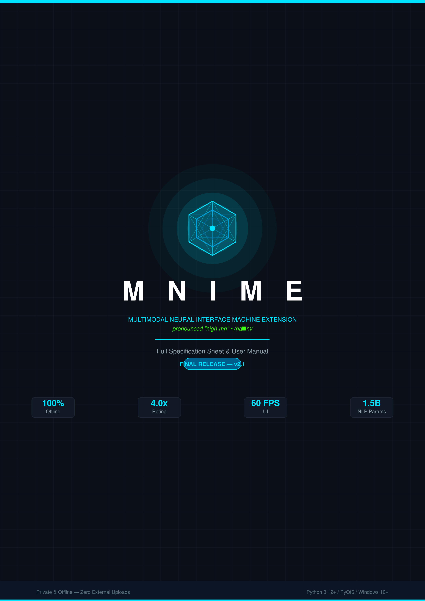

<p align="center">
  
</p>

<p align="center">MULTIMODAL NEURAL INTERFACE MACHINE EXTENSION</p>

A modern, private, and ultra-fast desktop interface with a fine-tuned local NLP engine built in. Engineered with Python and PyQt6, it runs 100% locally and offline on your machine with zero external uploads, giving you conversational interaction over your documents.

---

## Specification Sheet & User Manual

<p align="center">
  <a href="MNIME_Spec_Manual.pdf">
    
  </a>
</p>

<p align="center">
  <a href="MNIME_Spec_Manual.pdf">
    
  </a>
</p>

> **Specification Sheet & User Manual** — 14 sections covering all features, technical specs, architecture, NLP engine details, UI guide, installation, keyboard shortcuts, performance notes, dependency stack, error handling, and changelog.

---

## Key Features

1. **Merge Files**: Select up to 5000 PDF and image files, drag and drop to reorder, and merge them sequentially into a single PDF document.
2. **Edit Suite (Images & PDFs)**: Visually crop and rotate images and all pages within PDF documents seamlessly within the app.
3. **JPG → PDF**: Convert image files (`.jpg`, `.jpeg`, `.png`, `.webp`, `.bmp`) into a crisp, unified PDF document.
4. **PDF → Images**: Extract all pages from a PDF document into high-resolution JPG images.
5. **Compress PDF**: Optimize and reduce PDF file size by compressing content streams and duplicate objects.
6. **PDF → DOCX**: Convert PDF pages and text layout into editable .docx documents.
7. **Semantic Bookmarks**: Intelligently analyze PDF typography and use the bundled NLP engine to automatically generate verbose, context-aware chapter summaries.
8. **Local NLP Engine & Semantic Search (RAG)**: Query across all open PDFs locally using the bundled `MNIME-Core-1.5B-Q4_K_M.gguf` model — no configuration required.
9. **Smart Document Cross-Referencing**: Highlight sections in a PDF to automatically synthesize an NLP comparative brief against other documents.
10. **Expanded Translucent Pop-out Chat**: Double-click the NLP console to spawn a magnetic, translucent floating chat window perfectly synced with the main app.

### Visual & Aesthetic Highlights
- **Free-Floating Dark Metallic Design**: Seamless obsidian and brushed gunmetal interface without boxy enclosing containers.
- **Whispy Metallic Branding**: Custom procedurally generated metallic silver and chrome logo, featuring a mathematically precise 5D Penteract projection with true depth-sorting.
- **Clean Minimalist Dropzone**: Modern, distraction-free file drop canvas with real-time drag-and-drop feedback.
- **Interactive File Carousel**: Horizontal card slider with smooth scroll arrows and status badges.
- **Advanced File Explorer Dialog**: A custom, fully integrated PyQt6 file manager that replaces the generic OS popup, featuring a directory tree and clean list view matching the app's dark metallic theme.
- **Cinematic Transitions & VFX**: Features an interactive, physics-based particle simulation with an infinitely looping high-speed file vortex during background processing, capped off with a screen-flash transition. Plus, a playful neon green file orbiting independently in 3D around the 5D core.
- **Drag-and-Drop Reordering**: Rearrange file cards by dragging them left or right to change the processing order.
- **Card Thumbnails & Previews**: Real-time page rendering, file names, status overlays (`Waiting...`, `Processing...`, `Ready`), and remove buttons (`X`).

### High-Performance Engine & Optimizations
- **C-Accelerated PyMuPDF Core**: Multi-file merging, image extraction, and compression run through native C-level PyMuPDF routines (up to 50x faster than pure-Python libraries with negligible RAM footprint).
- **O(1) Carousel Layout Operations**: Drag-and-drop card reordering and card removal execute via surgical layout index shifts rather than tearing down and rebuilding hundreds of widgets.
- **Dynamic Memory Management**: The GGUF model and FAISS vector index are completely cleared from memory the moment NLP is toggled off or the app closes, preventing background memory hoarding.
- **Manual NLP Control**: The bundled model waits idly until you explicitly click the **Reload NLP** button, keeping startup times instant.
- **In-Memory Pixmap & Icon Caching**: Thumbnails and vector SVG icons are rasterized and pre-scaled once, eliminating CPU resampling during continuous scroll and hover events.
- **Lightweight Hardware-Accelerated Cards**: Replaced heavy drop shadow bitmap textures with pure stylesheet hardware borders, keeping UI scrolling silky smooth even with 5000 files loaded.
- **Non-blocking Background Processing**: Smooth 60 FPS UI using `QThread` workers with real-time progress bars.

### NLP Model — MNIME-Core
The `MNIME-Core-1.5B-Q4_K_M.gguf` model is a fine-tuned Qwen2.5-1.5B-Instruct model, quantized to Q4_K_M, trained specifically on document-processing and cross-referencing tasks. 

If you download the pre-built installer, it comes bundled out of the box. If you are running or building from source, you must download the model from [KyleDeanAI/MNIME-Core-1.5B-Q4_K_M](https://huggingface.co/KyleDeanAI/MNIME-Core-1.5B-Q4_K_M) and place it in the `models/` folder.

MNIME auto-detects the model on startup and will pick up the hardware it can find (NVIDIA GPU layers are set to `-1` by default, meaning the runtime offloads as many layers as will fit in VRAM automatically).

---

## Setup & Installation

### Option A — Standalone Installer (Recommended)
Run one of the two pre-built installers from the `installer/` folder:

| Installer | Description |
|---|---|
| `MNIME_Setup.exe` | Classic Windows wizard installer built with Inno Setup. Creates Start Menu entries and an optional desktop shortcut. |
| `MNIME_installer.exe` | Premium animated installer with a custom PyQt6 UI — branded dark window, animated flying-file progress bar, and automatic shortcut creation. |

Both installers place MNIME at `%LOCALAPPDATA%\Programs\MNIME`.

### Option B — Run from Source

**1. Initial Setup (Required)**

First, you must download the required NLP model from Hugging Face:
- Go to [KyleDeanAI/MNIME-Core-1.5B-Q4_K_M](https://huggingface.co/KyleDeanAI/MNIME-Core-1.5B-Q4_K_M)
- Download the `.gguf` model file.
- Place it inside the `models/` directory in this project.

Next, run `setup.bat` to automatically create a Python virtual environment and install all required dependencies from `requirements.txt`.

**2. Launch**

Double-click `run.bat`, or from a terminal:

```bat
.venv\Scripts\python.exe MNIME.py
```

**3. Pin to Taskbar**

Run `create_shortcut.bat` to generate a desktop shortcut, then right-click → **Pin to taskbar**.

---

## Building the Application

Run `build_app.bat` with Inno Setup 6 installed. 

**Note:** Ensure you have downloaded the `.gguf` model from Hugging Face into the `models/` folder first, otherwise it won't be packaged into your installers!

The script will:

1. Create/update the `.venv` and install all build dependencies.
2. Compile the app with PyInstaller using `MNIME.spec` → `dist/MNIME/`.
3. Package it into `installer/MNIME_Setup.exe` via Inno Setup (supports optional code signing with `MNIMECert.pfx`).
4. Build the custom animated installer `installer/MNIME_installer.exe` via PyInstaller + `custom_installer.py`.

---

## Changelog

### MNIME Final — Bundled NLP Model
- **Changed**: The fine-tuned `MNIME-Core-1.5B-Q4_K_M.gguf` model is now bundled directly inside the application under `models/`. No external model download or Settings configuration is required.
- **Removed**: The Settings gear icon and NLP hardware configuration dialog have been removed. Hardware offloading is handled automatically at runtime.
- **Removed**: The finetuning workflow (`training/`) is no longer part of the repository. The model is shipped as a finished artifact.
- **Added**: Two parallel installer formats — `MNIME_Setup.exe` (Inno Setup) and `MNIME_installer.exe` (custom animated PyQt6 installer).

### MNIME — UI & UX Complete Overhaul
- **Added**: Procedurally generated 5D Penteract branding logo with true mathematical 3D depth-sorting and an independent orbiting neon file.
- **Added**: Advanced High-Resolution 4.0x Retina rendering pipeline for the PDF Reader and Edit UIs, producing razor-sharp vector text.
- **Added**: Fluid `Ctrl+Scroll` mouse wheel zoom capabilities across all document viewer and editor viewports.
- **Improved**: The Reader UI has been completely decoupled from the main window, featuring its own independent resizable frameless dark metallic window, automatic document fitting with margin padding, native smooth diagonal resizing, and integrated file-explorer connectivity.
- **Improved**: The Image and PDF Edit UIs have been fully upgraded to the MNIME translucent dark metallic theme, matching the rest of the application's premium aesthetic.

### Compatibility & Stability
- **Fixed**: Model loading crash on Python 3.13+ caused by a `longdouble` overflow in NumPy 1.x `getlimits.py`.
- **Updated**: NumPy dependency bumped to `>=2.0.0`. NumPy 2.x resolves the broken `_register_known_types` initialization on Windows with Python 3.13+.
- **Updated**: `pyproject.toml` now correctly lists `numpy>=2.0.0` and `llama-cpp-python>=0.2.75` as explicit dependencies.

### Initial Public Release
- Full feature set: Merge, Edit, JPG↔PDF, Compress, DOCX export, Semantic Bookmarks, NLP/RAG chat, Cross-Reference engine.
- Free-floating dark metallic PyQt6 UI with physics particle transitions.
- Local offline GGUF model integration via `llama-cpp-python`.

---

## Project Architecture

```
MNIME/
├── core/                  # Core processing engine
│   ├── __init__.py
│   ├── app_icon.py        # Win32 icons & properties
│   ├── file_item.py       # Data model & thumbnails
│   ├── nlp_engine.py      # GGUF model integration
│   ├── pdf_engine.py      # PDF logic & conversion
│   ├── search_engine.py   # FAISS semantic search
│   └── worker.py          # Async background worker
├── models/                # Bundled NLP model
│   └── MNIME-Core-1.5B-Q4_K_M.gguf
├── ui/                    # Desktop GUI (PyQt6)
│   ├── __init__.py
│   ├── action_bar.py      # Action buttons & progress
│   ├── carousel_view.py   # Horizontal file gallery
│   ├── cursor_fx.py       # Custom cursor effects
│   ├── document_viewer.py # Document visualizer
│   ├── file_card.py       # Interactive file cards
│   ├── file_dialog.py     # Dark-mode file explorer
│   ├── icons.py           # Vector SVG icons
│   ├── image_editor.py    # Image editor UI
│   ├── main_window.py     # Main window coordinator
│   ├── merge_particles.py # Physics transitions
│   ├── minimize_animation.py # Minimize animations
│   ├── nlp_view.py        # RAG interface
│   ├── output_view.py     # Processing log output
│   ├── pdf_editor.py      # PDF editor UI
│   ├── reader_dialog.py   # Frameless document reader
│   └── tabs_bar.py        # App mode switcher
├── MN.ico                 # Multi-res native icon
├── MNIME.py               # Application entry point
├── custom_installer.py    # PyQt6 installer UI
├── MNIME.iss              # Inno Setup script
├── MNIME.spec             # PyInstaller spec
├── MNIME_installer.spec   # Animated installer spec
├── benchmark.py           # NLP empirical benchmark
├── build_app.bat          # Full build pipeline
├── install_mnime.bat      # 1-click local installer
├── run.bat                # 1-click Windows runner
├── setup.bat              # Python venv setup
├── pyproject.toml         # Build configuration
├── requirements.txt       # Python dependencies
├── LICENSE                # Open source license
└── README.md              # Project documentation
```

---

## Help & User Guide

**MNIME** — your next-generation, private, high-performance offline document interface. Designed with a premium dark-metallic and neon-blue aesthetic, MNIME provides blazing-fast document processing entirely offline.

### Core Capabilities

All tools are accessible from the top **Tabs Bar**.

- **Combine PDF**: Merge multiple PDF documents into a single file.
- **JPG to PDF**: Convert image files into a high-quality PDF.
- **TXT to PDF**: Rapidly convert raw text files into searchable, native vector PDFs.
- **PDF to JPG**: Export pages of a PDF into high-resolution JPG images.
- **Split PDF**: Separate a multi-page PDF into individual files. Features NLP-powered Smart Naming that reads page content to automatically generate unique, relevant filenames.
- **Compress PDF**: Reduce the file size of heavy PDF documents.
- **PDF to DOCX**: Convert PDFs into editable Word documents.
- **Bookmark**: Add structured bookmarks to your PDF using either fast native heuristics or NLP-powered semantic chapter summaries.

### NLP & Reference Engine

MNIME ships with a fine-tuned local model that requires no setup.

- **NLP**: Engage with your documents using a conversational interface powered by the bundled `MNIME-Core-1.5B-Q4_K_M.gguf` model. Click **Reload NLP** in the tabs bar to load the model into memory.
- **Reference**: Generate synthesized briefs and cross-reference information across multiple uploaded documents.
- **NLP Toggle**: The **"NLP"** checkbox in the tabs bar acts as a master switch. Turn it off to instantly unload the model and run the app in ultra-lightweight mode.

### Interface Guide

#### 1. The Drop Zone (Right Side)
- **Drag and Drop**: Drag files over the MNIME logo to queue them for processing.
- **Add Files Button**: Click the neon-outlined `ADD FILES` button to open the custom file browser.

#### 2. Gallery Carousel (Left Side)
Once files are added, they appear as interactive cards in the **Gallery Carousel**.
- **Scroll & Reorder**: Scroll horizontally to view all queued files. Click and drag cards to reorder them.
- **Clear All**: Click the neon-red **"X"** icon to clear your entire file queue.

#### 3. Action Bar
The bottom of the screen houses the **Action Bar**.
- **Primary Action Button**: Initiates the processing engine for the selected mode (e.g., `MERGE FILES`).
- **Progress Indicator**: A sleek progress bar appears during processing.

#### 4. Document Reader & Editor
MNIME includes a built-in high-resolution **Document Reader** and **Edit UI**.
- **High-Res Rendering**: Documents are rendered at 4.0x Retina pixel density for ultra-sharp, anti-aliased clarity.
- **Fluid Zooming**: Use `Ctrl + Mouse Scroll` to smoothly zoom in and out.
- **Independent Windows**: The Reader and Editor run as fully independent, resizable, frameless dark metallic windows.

### Error Handling & Validation
If you attempt to run a tool with the wrong file type or an empty queue, the application will intelligently intercept the action and provide a helpful prompt without crashing.

### Semantic Bookmarks
MNIME offers two powerful ways to generate document outlines and table of contents for unbookmarked PDFs:
- **Heuristic Mode**: Rapidly analyzes PDF typography, font sizes, and structural layout to instantly build an accurate nested bookmark tree using native heuristics.
- **NLP Mode**: Leverages the bundled MNIME-Core model to contextually understand headers, generating highly descriptive, semantic chapter summaries for each outline entry.

### Empirical Benchmarking & External Validation
MNIME bundles a standalone graphical benchmarking utility (`benchmark.py`) designed for users and researchers to independently validate on-device model throughput, latency, and hardware metrics:
- **Interactive Performance GUI**: Launch via `.venv\Scripts\python.exe benchmark.py` to open a dedicated hardware performance console.
- **Empirical Telemetry**: Empirically measures prompt ingestion speed, first-token latency, and sustained token generation throughput (tokens/second) against the bundled `MNIME-Core-1.5B-Q4_K_M.gguf` model.
- **External Replication**: Allows users to ground and replicate the empirical benchmarks reported in Section 5 of the research paper directly on their own local machine without external dependencies.

---


<p align="center">
  <a href="MNIME_paper.pdf">
    
  </a>
</p>

<p align="center">
  <a href="MNIME_paper.pdf">
    
  </a>
</p>

> **MNIME Research Paper** — covering system architecture, the MNIME-Core fine-tuning methodology, NLP/RAG engine design, projected performance characteristics, and a discussion of privacy-first local document AI.

---

_MNIME_ - '26kb
